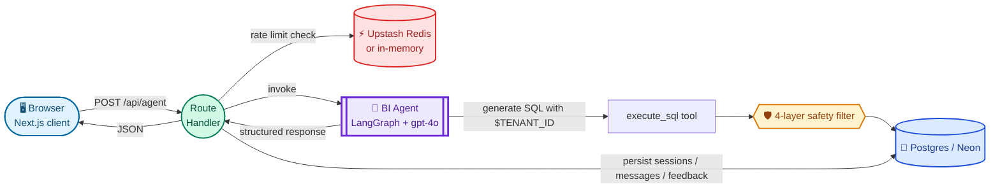

# Analytics Agent

A natural-language BI chat agent that answers questions about a real e-commerce dataset by generating SQL, running it through a four-layer safety filter, and rendering the result as a chart, table, or conversational reply.

> **Live demo:** _coming soon_ — see [Deployment](#deployment) below.

```
You ask                                The agent does
──────────────────────────             ───────────────────────────────────────
"What are the top 10                   1. Picks chart type → "bar"
 product categories                    2. Generates SQL with $TENANT_ID guard
 by revenue?"                          3. Runs sanitize → allowlist → tenant
                                          inject → LIMIT cap
                                       4. Executes against Postgres
                                       5. Returns: { answer, chartConfig, data, followUp[] }
                                       6. UI renders a Recharts bar chart
```

## Why this exists

This is a portable, public-friendly extraction of a BI agent that powers an internal admin tool. The agent itself is unchanged — same LangGraph orchestration, same SQL safety layers, same structured-output discriminated union. What's different is the surrounding skin: a reskinned chat UI, no auth, an open dataset (Olist Brazilian e-commerce), and rate-limit guardrails appropriate for a public URL.

It's intended as a sample-work artifact: clone the repo, run it locally, look at how the agent is built.

## Architecture at a glance



## Inside the agent

The agent is split across five focused files. Everything else in this repo (UI, API routes, persistence, rate limiting) is a thin shell around them. This section is a precision index — every cell is a clickable link to the source line.

### `lib/ai/biAgent.ts` — entry point (~52 lines)

Wires model + tools + middleware + response format. Owns `biContextSchema` and `BIContext` (the per-invocation envelope) so agent identity lives in one place.

| Where                             | What                                                                                |
| --------------------------------- | ----------------------------------------------------------------------------------- |
| [L20–27](./lib/ai/biAgent.ts#L20) | `biContextSchema` — the per-invocation envelope (`tenantId`, `sessionId`, `userId`) |
| [L40–44](./lib/ai/biAgent.ts#L40) | `ChatOpenAI` config — `gpt-4o`, `temperature: 0.1`, `maxTokens: 1500`               |
| [L46–52](./lib/ai/biAgent.ts#L46) | `createAgent` — wires model + tool + middleware + Zod `responseFormat`              |

### `lib/ai/prompts/biSystemPrompt.ts` — the cacheable prompt (~204 lines)

All three prompt constants and their concatenation in one file. The header comment is the loudest in the codebase: editing this file has a real cost-and-latency consequence (OpenAI prompt cache keys on byte equivalence ≥ 1024 tokens).

| Where                                               | What                                                                                                                                                             |
| --------------------------------------------------- | ---------------------------------------------------------------------------------------------------------------------------------------------------------------- |
| [L17–38](./lib/ai/prompts/biSystemPrompt.ts#L17)    | `BI_BASE_PROMPT` — persona + the load-bearing "never invent or fabricate data" guardrail                                                                         |
| [L40–170](./lib/ai/prompts/biSystemPrompt.ts#L40)   | `BI_SCHEMA` — full DB schema embedded for SQL generation (column types, FK shape, soft-reference gaps, tenant-isolation contract). No RAG layer; the schema fits |
| [L172–199](./lib/ai/prompts/biSystemPrompt.ts#L172) | `BI_RULES` — chart-selection rules (when to pick `horizontal_bar` over `bar`, when `stacked_bar` requires a `series` array, etc.) + critical SQL rules           |
| [L204](./lib/ai/prompts/biSystemPrompt.ts#L204)     | `BI_SYSTEM_PROMPT_PREFIX` — the cacheable static block (~3,500 tokens). Cached prefixes are ~50% cheaper and ~10× lower latency on hits                          |

### `lib/ai/prompts/biFewShot.ts` — SQL example corpus (~155 lines)

8 hand-written few-shot SQL examples (one per chart pattern) and the `FewShotPromptTemplate` that consumes them. Formatted once at module load; the lazy pattern preserves cold-start semantics.

| Where                                          | What                                                                                                                                           |
| ---------------------------------------------- | ---------------------------------------------------------------------------------------------------------------------------------------------- |
| [L12–143](./lib/ai/prompts/biFewShot.ts#L12)   | `SQL_EXAMPLES` — one per chart pattern (line, bar, horizontal_bar, pie, table, stacked_bar, area, scatter); every example carries `$TENANT_ID` |
| [L145–151](./lib/ai/prompts/biFewShot.ts#L145) | `FewShotPromptTemplate` — formatted once at module load                                                                                        |
| [L154–155](./lib/ai/prompts/biFewShot.ts#L154) | `formattedExamples` — exported `let`; Node ES-module live binding lets middleware read the post-format value                                   |

### `lib/ai/middleware/biMiddleware.ts` — history + prompt assembly (~54 lines)

| Where                                             | What                                                                                                                        |
| ------------------------------------------------- | --------------------------------------------------------------------------------------------------------------------------- |
| [L21–36](./lib/ai/middleware/biMiddleware.ts#L21) | `beforeModel` — trims to last 20 messages via `RemoveMessage` + `REMOVE_ALL_MESSAGES` sentinel                              |
| [L41–52](./lib/ai/middleware/biMiddleware.ts#L41) | `wrapModelCall` — appends few-shot examples + `current_date` _after_ the prefix; daily variance never invalidates the cache |

### `lib/ai/tools/biTools.ts` — the gate (185 lines)

The single tool the agent has access to. Every SQL query the LLM generates is forced through four sanitization layers before it touches the database, plus a server-side tenant injection step the LLM cannot bypass.

| Where                                      | What                                                                                                                                                                                                                           |
| ------------------------------------------ | ------------------------------------------------------------------------------------------------------------------------------------------------------------------------------------------------------------------------------ |
| [L19–37](./lib/ai/tools/biTools.ts#L19)    | 17 blocked DML/DDL keywords (`INSERT`, `UPDATE`, `DELETE`, `DROP`, `ALTER`, `TRUNCATE`, `EXEC`, `MERGE`, …)                                                                                                                    |
| [L39–49](./lib/ai/tools/biTools.ts#L39)    | 9-table allowlist — only the analytical tables. The agent's own persistence tables (`agent_sessions`, `agent_messages`, `agent_feedback`) are deliberately excluded so the LLM cannot read its own message history through SQL |
| [L62–65](./lib/ai/tools/biTools.ts#L62)    | **Layer 1** — must start with `SELECT` or `WITH` (CTEs). Everything else (`PRAGMA`, `EXPLAIN`, `COPY`) bounces                                                                                                                 |
| [L67–71](./lib/ai/tools/biTools.ts#L67)    | **Layer 2** — single statement only (defeats `SELECT … ; DROP TABLE x`)                                                                                                                                                        |
| [L73–82](./lib/ai/tools/biTools.ts#L73)    | **Layer 3** — keyword blocklist applied to the query _with string literals stripped first_ ([L74](./lib/ai/tools/biTools.ts#L74)), so legitimate `WHERE status = 'INSERT'` queries pass                                        |
| [L84–95](./lib/ai/tools/biTools.ts#L84)    | **Layer 4** — every table reference cross-checked against the allowlist                                                                                                                                                        |
| [L97–109](./lib/ai/tools/biTools.ts#L97)   | `LIMIT` enforcement — default 100, hard cap 500. `LIMIT 99999` is rewritten to `LIMIT 500`                                                                                                                                     |
| [L114–118](./lib/ai/tools/biTools.ts#L114) | `injectTenantId` — server-side string replace; the model never sees the literal value                                                                                                                                          |
| [L132–139](./lib/ai/tools/biTools.ts#L132) | `executeSql` rejects any query missing literal `$TENANT_ID` — tenant isolation is mandatory at the protocol layer, not just by convention                                                                                      |

### `lib/ai/schemas/biAgentResponse.ts` — the contract (101 lines)

The Zod-based discriminated union the agent is forced to return. OpenAI's strict structured-output mode parses to this schema or fails — there is no escape hatch, no markdown JSON wrapping, no malformed responses.

| Where                                              | What                                                                                                                                                                                                                                                               |
| -------------------------------------------------- | ------------------------------------------------------------------------------------------------------------------------------------------------------------------------------------------------------------------------------------------------------------------ |
| [L11–47](./lib/ai/schemas/biAgentResponse.ts#L11)  | `ChartConfigSchema` — 8 chart types (`bar`, `horizontal_bar`, `stacked_bar`, `line`, `area`, `pie`, `scatter`, `table`); `series` is `z.array().nullable()` ([L42–46](./lib/ai/schemas/biAgentResponse.ts#L42)) because OpenAI strict mode rejects optional fields |
| [L49–62](./lib/ai/schemas/biAgentResponse.ts#L49)  | `bi_data` variant — answer + chartConfig + 1–4 follow-ups                                                                                                                                                                                                          |
| [L64–74](./lib/ai/schemas/biAgentResponse.ts#L64)  | `bi_conversational` variant — for greetings or non-data questions                                                                                                                                                                                                  |
| [L76–86](./lib/ai/schemas/biAgentResponse.ts#L76)  | `bi_error` variant — for refusals (out-of-scope, schema violations)                                                                                                                                                                                                |
| [L88–92](./lib/ai/schemas/biAgentResponse.ts#L88)  | The discriminated union — runtime exhaustiveness for free                                                                                                                                                                                                          |
| [L99–101](./lib/ai/schemas/biAgentResponse.ts#L99) | Wrapped in `z.object()` because LangChain's `responseFormat` only accepts `ZodObject`, not unions directly. The header comment ([L1–8](./lib/ai/schemas/biAgentResponse.ts#L1)) documents the landmine                                                             |

### `lib/ai/biAgentService.ts` — the boundary (~168 lines)

The HTTP-side glue. Converts plain message history to LangChain types, attaches optional Langfuse tracing, invokes the agent, and pulls the raw SQL data and authored query out of LangGraph's message log for the UI.

| Where                                       | What                                                                                                                                                               |
| ------------------------------------------- | ------------------------------------------------------------------------------------------------------------------------------------------------------------------ |
| [L19–48](./lib/ai/biAgentService.ts#L19)    | Request/response interfaces — the contract between the route handler and the agent                                                                                 |
| [L55–67](./lib/ai/biAgentService.ts#L55)    | `buildLangfuseCallbacks` — full distributed tracing when `LANGFUSE_PUBLIC_KEY` and `LANGFUSE_SECRET_KEY` are set; no-op otherwise                                  |
| [L73–120](./lib/ai/biAgentService.ts#L73)   | `invokeBIAgent` — main entry; wires tenant context into LangGraph's `configurable` so the tool layer can read it                                                   |
| [L128–153](./lib/ai/biAgentService.ts#L128) | `extractToolData` — walks `ToolMessage`s in reverse to pull raw rows; the `structuredResponse` only carries the LLM's _summary_, the actual data lives in messages |
| [L159–178](./lib/ai/biAgentService.ts#L159) | `extractToolSql` — surfaces the LLM-authored query (with `$TENANT_ID` still in place) so the UI can render it as a copyable, tenant-agnostic block                 |

Session title generation has moved to [`lib/ai/sessionTitle.ts`](./lib/ai/sessionTitle.ts) — separate `gpt-4o-mini` call (20 tokens, temp 0.3) to name new chat sessions.

## The security model (the most important part)

Every SQL query the LLM generates passes through four gates in [`lib/ai/tools/biTools.ts`](./lib/ai/tools/biTools.ts) before it touches the database:

1. **Statement-type filter** — only `SELECT` and `WITH` (CTEs) accepted; everything else rejected with a typed error.
2. **Single-statement enforcement** — chained statements (`SELECT ...; DROP TABLE ...`) blocked.
3. **DML/DDL keyword blocklist** — 17 reserved words (`INSERT`, `UPDATE`, `DELETE`, `DROP`, etc.) blocked at the regex level. String literals are stripped before the check so legitimate `WHERE status = 'INSERT'` queries pass.
4. **Table allowlist** — only the 9 analytical tables in [`lib/ai/tools/biTools.ts:39-49`](./lib/ai/tools/biTools.ts#L39) are reachable. The agent's own persistence tables (`agent_sessions`, etc.) are deliberately excluded.

On top of these, every query _must literally contain_ `$TENANT_ID` — the LLM is forced to acknowledge tenant isolation at generation time, and the server replaces the placeholder with the configured tenant id. `LIMIT` is enforced at 500 max, defaulting to 100 if absent.

The unit tests in [`tests/biTools.test.ts`](./tests/biTools.test.ts) prove each of these layers independently.

## Try these (one per chart type)

| Chart      | Question                                                              |
| ---------- | --------------------------------------------------------------------- |
| 📈 line    | _Show me monthly revenue trends across 2017_                          |
| 🌊 area    | _How did cumulative orders grow over 2017?_                           |
| 📊 bar     | _What are the top 10 product categories by revenue?_                  |
| 🏆 ranked  | _Rank the top 15 sellers by total revenue shipped_                    |
| 🧱 stacked | _Show payment type composition by month across 2017_                  |
| 🥧 pie     | _Break down orders by payment method_                                 |
| ✨ scatter | _Is there a relationship between product price and review score?_     |
| 📋 table   | _List the top 20 sellers by average review score, minimum 50 reviews_ |

These are also surfaced as click-to-send chips on the empty chat screen ([`components/chat/SampleQueries.tsx`](./components/chat/SampleQueries.tsx)).

## Cost protection (the demo is open, not unlimited)

Three layers, because rate limiting alone isn't enough — a determined attacker rotating IPs can still drain the LLM budget:

1. **Per-IP rate limit** on `POST /api/agent` — 35 requests/IP/hour by default (configurable via `RATE_LIMIT_PER_HOUR`) via Upstash Redis sorted set, or in-memory `Map` fallback in dev. Returns 429 with `Retry-After`. See [`lib/ratelimit/index.ts:13`](./lib/ratelimit/index.ts#L13).
2. **Per-request token cap** — `maxTokens: 1500` on the gpt-4o call ([`lib/ai/biAgent.ts`](./lib/ai/biAgent.ts)).
3. **OpenAI dashboard spend cap** — set on the API key in production. This is the actual safety net.

## Local setup

### Prerequisites

- Node 22+
- pnpm 10+
- A Neon Postgres database (free tier works) — or any Postgres reachable via `DATABASE_URL`
- An OpenAI API key with a monthly spend cap set

### Steps

```bash
git clone https://github.com/sw00z/analytics-agent-demo
cd analytics-agent-demo
pnpm install

cp .env.example .env
# Edit .env with your DATABASE_URL and OPENAI_API_KEY
```

Push the schema:

```bash
pnpm db:push
```

Download the Olist dataset:

1. Visit [https://www.kaggle.com/datasets/olistbr/brazilian-ecommerce](https://www.kaggle.com/datasets/olistbr/brazilian-ecommerce) (free Kaggle account required).
2. Click **Download** → you'll get `archive.zip` (~45 MB).
3. Extract the 9 CSVs into `seed/raw/`.

Seed:

```bash
pnpm seed
```

Run:

```bash
pnpm dev
```

Visit [http://localhost:3000/chat](http://localhost:3000/chat).

## Deployment

The repo is structured for **Vercel + Neon**:

1. Create a Neon project, copy `DATABASE_URL`.
2. Create an OpenAI key, set a monthly spend cap.
3. (Optional) Create an Upstash Redis database for durable rate limiting; copy `UPSTASH_REDIS_REST_URL` + `UPSTASH_REDIS_REST_TOKEN`.
4. Push to GitHub, import the repo in Vercel.
5. Add the env vars from `.env.example` to Vercel's project settings.
6. Run `pnpm db:push` and `pnpm seed` against the production Neon URL once.

Without Upstash, rate limiting falls back to per-instance in-memory — fine for local dev, less so for a public URL where Vercel may spawn multiple instances.

## Repo layout

```
app/                              Next.js App Router
├── api/agent/
│   ├── route.ts                  POST — main BI query handler
│   ├── sessions/route.ts         GET / POST sessions
│   ├── sessions/[id]/route.ts    GET / PUT / DELETE one session
│   └── feedback/route.ts         POST — thumbs up/down + comment
├── chat/
│   ├── page.tsx                  Server Component
│   └── chat-shell.tsx            Client orchestrator
├── layout.tsx                    Wraps in Providers (TanStack Query)
└── providers.tsx                 QueryClient

lib/
├── ai/
│   ├── biAgent.ts                LangGraph agent: model + context schema + createAgent wiring
│   ├── biAgentService.ts         HTTP boundary, Langfuse, tool data extraction
│   ├── sessionTitle.ts           gpt-4o-mini session title generation
│   ├── middleware/
│   │   └── biMiddleware.ts       History truncation + dynamic prompt assembly
│   ├── prompts/
│   │   ├── biSystemPrompt.ts     ★ Cacheable prefix (persona + schema + rules)
│   │   └── biFewShot.ts          8 few-shot SQL examples + FewShotPromptTemplate
│   ├── tools/biTools.ts          ★ The 4-layer SQL safety filter
│   └── schemas/biAgentResponse.ts Zod discriminated union
├── api/agent.ts                  Client-side fetch helpers + types
├── charts/
│   ├── axis.ts                   Recharts axis fit / tick truncation helpers
│   └── format.ts                 Currency / number / chart-height helpers
├── db/
│   ├── client.ts                 Neon serverless connection
│   ├── schema.ts                 Drizzle: 9 Olist tables + 3 agent tables
│   └── queries.ts                Session/message/feedback CRUD
├── hooks/
│   ├── useChatFeedback.ts        Thumbs feedback mutation
│   ├── useChatScroll.ts          Double-rAF scroll anchoring
│   ├── useChatStreaming.ts       Optimistic placeholder + 429 surfacing
│   ├── useDemoUser.ts            localStorage UUID for per-browser sessions
│   └── useSessionMessages.ts     Persisted-session hydration
├── messages/labels.ts            Chart kicker + caption vocabulary
├── ratelimit/index.ts            Upstash + in-memory hybrid limiter
└── utils.ts                      cn() helper

components/
├── ui/                           shadcn primitives (Base UI + Tailwind v4)
└── chat/
    ├── ChatPanel.tsx             Orchestrator: messages, input, mutations
    ├── ChartRenderer.tsx         Recharts switch on chartConfig.type
    ├── FeedbackDialog.tsx        Thumbs + optional comment
    ├── FollowUpChips.tsx         Click-to-send suggested questions
    ├── MessageBubble.tsx         Variant dispatcher (user / assistant / error)
    ├── ResultTable.tsx           Tabular renderer
    ├── SampleQueries.tsx         Empty-state starters (one per chart type)
    ├── SessionsDropdown.tsx      Masthead session list + delete
    ├── charts/
    │   ├── BarChart.tsx          bar / horizontal_bar / stacked_bar
    │   ├── EmptyState.tsx        Zero-row fallback
    │   ├── LineAreaChart.tsx     line / area
    │   ├── PieChart.tsx          Donut + auto "Other" aggregation
    │   ├── ScatterChart.tsx      Density-driven dots
    │   └── shared/
    │       ├── PieLabel.tsx      Custom SVG label renderer
    │       └── styles.ts         Shared visual constants
    ├── message/
    │   ├── AssistantFigure.tsx   <figure> wrapper around ChartRenderer
    │   ├── ErrorBubble.tsx       "Note." printer-style block
    │   ├── MessageActions.tsx    Feedback + copy popover
    │   ├── SqlBlock.tsx          Collapsible LLM-authored SQL block
    │   ├── ThinkingIndicator.tsx Three staggered pulsing dots
    │   ├── UserBubble.tsx        Italic serif user turn
    │   └── primitives.tsx        Shared micro-components
    └── panel/
        ├── ChatInput.tsx         Bottom composer
        ├── EmptyState.tsx        Cold-start screen
        ├── MessageList.tsx       Maps DisplayMessage[] → MessageBubble
        └── ScrollbarThumb.tsx    Custom overlay scrollbar

scripts/seed.ts                   CSV → Postgres bulk seed
tests/
├── chartsAxis.test.ts            Recharts axis-fit regression tests
├── biTools.test.ts               SQL safety unit tests
└── biAgentService.test.ts        Tool-message extraction unit tests
proxy.ts                          Next.js middleware: / → /chat
```

## Tech stack

- **Next.js 16** + React 19 + Tailwind v4 + shadcn/ui (Base UI primitives)
- **LangChain v1** + `@langchain/langgraph` for the agent
- **OpenAI** gpt-4o (BI agent) + gpt-4o-mini (session-title generation)
- **Postgres** via Neon serverless + Drizzle ORM
- **TanStack Query** for client-side state
- **Recharts** for charting
- **Vitest** for tests
- **Upstash Redis** (optional) for distributed rate limiting

## Dataset attribution

Brazilian E-Commerce Public Dataset by [Olist](https://olist.com/), originally published on [Kaggle](https://www.kaggle.com/datasets/olistbr/brazilian-ecommerce) under [CC BY-NC-SA 4.0](https://creativecommons.org/licenses/by-nc-sa/4.0/). The dataset contains ~99K real (anonymized) orders made on the Olist marketplace between September 2016 and October 2018.

## License

Code: MIT. Dataset: CC BY-NC-SA 4.0 (see attribution above).
